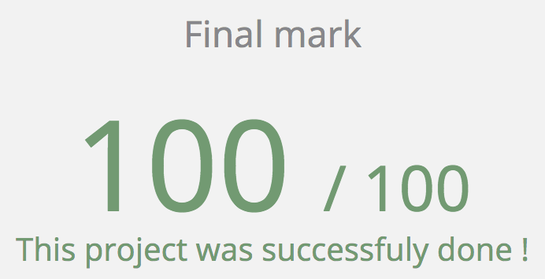

# C Exams (42 US - Silicon Valley)

I'll place all of the problems successfully completed during the exams.
Some of this problems may be from project's exercises, while other may be
completely new. The exams goes by levels, starting from level 0.
By doing each problem correctly, one level up, and so the difficulty of
the problems. If one fails a problem, you can retry another problem in
the same level, but without getting the full marks.

## Score

### TODO

The following problems are pending, I haven't solved them yet.

* Level 4:
	- check_mate

* Level 5:
	- rpn_calc

## Support

All my projects are free to read/clone on GitHub. I don't expect anyone to support me,
but if you want, I really appreciate it from the bottom of my heart. ❤️

^ You can scan the code abover if you would like to support me with one amount, and I thank you in advance.
